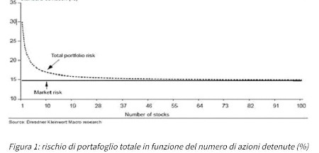

# Come diversificare i tuoi investimenti?

## Gli asset in un portafoglio

Nonostante il concetto di diversificazione è comunemente accettato, molti investitori non lo praticano o per pigrizia o perché affascinati dalle ultime news su azioni over performanti. 

Uno dei migliori modi per ridurre il rischio negli investimenti è diversificarli investendo in asset di 
tipo diverso. 

Tipicamente gli asset su cui gli investitori concentrano maggiore attenzione sono:

1. Azioni
2. Obbligazioni
3. Cash
4. Materie Prime (es. Oro) o titoli legati all'inflazione

Esistono altri tipi di asset come Immobili (in gergo Real-Estate), Arte, etc. ma non li tratteremo in questa guida.

Sul lungo periodo le azioni sono notoriamente il miglior investimento possibile, tuttavia, nel breve termine subiscono variazioni anche considerevoli a causa della loro alta volatilità. Per questo motivo si preferisce avere, nel proprio portafoglio, un mix di Azioni e Obbligazioni. 

Le Obbligazioni sono essenzialmente prestiti che l'investitore fa allo Stato (es. comprando BOT o BTP) oppure alle aziende (es. Corporate Bond). Notoriamente le
Obbligazioni hanno una minore volatilità e, quindi, un rischio minore e se le si tiene fino alla scadenza restituiscono sempre il Capitale + l'interesse pattuito.

Il mix più comunemente usato nei portafogli è il classico 40% Azioni e 60% Obbligazioni. Tuttavia, ci sono periodi in cui sia Azioni che Obbligazioni subiscono dei rallentamenti se non addirittura perdite. Per tali cicli economici è consigliabile avere i propri risparmi in forma Cash. 

Con il termine Cash non si intende i soldi che abbiamo sul Conto Corrente (su cui è sempre bene avere una piccola quota solo per i bisogni quotidiani), ma sono tutte quelle forme di investimento in cui è possibile liquidare la posizione velocemente come, ad esempio, i Conti Deposito o BOT con scadenza di 1 anno o meno (quelli che gli americani chiamano Tresury Bond).

Inoltre, nei periodi di alta inflazione la perdita di potere di acquisto dei propri investimenti potrebbe essere ingente. Per questi periodi potrebbe essere utile investire in materie prime come l'Oro.

## Inflazione e Volatilità

Inflazione e Volatilità sono due rischi da considerare sempre in qualsiasi investimento. 

Quando l'Inflazione è alta (es. 5% in un anno) anche un buon investimento con un
ritorno del 4% potrebbe risultare non sufficiente perché alla fine si ha una perdita del potere di acquisto di 1%. Per questo motivo l'investitore deve sempre essere al corrente dei tassi di inflazione in un dato periodo e investire in modo tale da assorbire le perdite di potere di acquisto dovute ad essa.

L'altro elemento di rischio è la Volatilità. Con questo termine si intende l'oscillazione di prezzo, in un dato periodo, intorno al suo valore medio. Conoscere la Volatilità di un asset è fondamentale per capire la perdita massima che si può avere in un dato investimento e la probabilità che ciò avvenga.

## Rischi sistematici e non sistematici

La diversificazione non deve avvenire solo tra asset diversi, ma anche all'interno di un medesimo asset. Se consideriamo le sole Azioni possiamo avere
due ulteriori rischi:

1. Rischio non sistematico;
2. Rischio sistematico.

Ad esempio, se compro azioni di Apple nel settore tecnologico, Apple potrebbe andare male anche se la scelta del settore è giusta. Per cui avere più Azioni del settore tecnologico (es. Microsoft e Google) potrebbe aiutarci a ridurre il rischio. Questo tipo di rischio si chiama Rischio non Sistematico.

**Ma quante azioni diverse bisognerebbe avere nel proprio portafoglio?**

Il seguente grafico mostra il Rischio per il numero di Azioni in portafoglio. Come si vede aggiungere due o tre azioni abbassa di molto il rischio, allo stesso tempo oltre 9 o 12 Azioni aggiungere altre Azioni non contribuisce alla diminuzione del rischio.

Il problema della diversificazione aggiungendo più azioni del medesimo settore non aiuta a risolvere il problema del Rischio Sistematico. 

Se l'intero settore tecnologico crolla allora avere Azioni diverse in quel settore non aiuta a ridurre le perdite del proprio portafoglio. Questo perché sia le Azioni di Apple, Microsoft e Google sono fortemente correlate al settore tecnologico. Quindi è bene diversificare i proprio Asset in settori diversi.

## Correlazioni degli Asset

Due Asset si dicono correlati se l'aumentare dell'uno comporta l'aumento dell'altro e viceversa. È possibile calcolare la correlazione tra vari Asset e, una volta in possesso di questa misura, evitare di avere nel proprio portafoglio Asset fortemente correlati. In questo modo, il decrescere del valore di un Asset non comporterà, necessariamente, la diminuizione di altri Asset nel proprio portafoglio.

## Investire non è un gioco a somma zero

Qualcuno potrebbe pensare, a questo punto, che alla fine il portafoglio diventi un gioco a somma zero dove tra Asset che guadagnano e Asset che perdono il guadagno totale è pressoché nullo. Fortunatamente non è così, se si ha in portafoglio un paio di Azioni che performano bene, un paio mediocri e cinque pessime,  è facile che le prime raddoppino o triplichino il proprio valore mentre è difficile che un'azione arrivi alla bancarotta.

## Conclusioni

Diversificare gli Asset in un portafoglio è la prima strada da intraprendere per ridurre i Rischi sistematici e non. Inflazione e Volatilità sono due rischi da tener ben presente. Il primo erode parte dei guadagni mentre il secondo fornisce una misura attraverso cui è possibile sapere la perdita massima che si può avere in un investimento e la probabilità che ciò accada. Diversificare significa anche avere nel proprio portafoglio Asset a bassa correlazione così che se uno è in perdita non è detto che lo sia un altro. Alla fine la gestione di un portafoglio non è un gioco a somma zero e, a volte, basta avere pochi Asset che performano bene per avere un buon guadagno sull'intero portafoglio.
